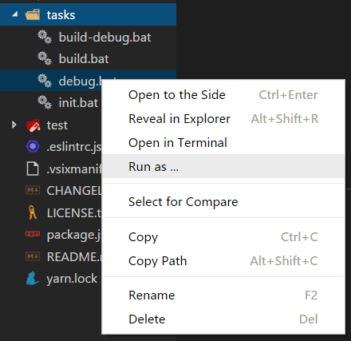

# Run As

VSCode extension.

## What can it do ?

**Right Click a file**, then
- Run as javascript in node
  - Run as a simple javascript's test in node
- Run as javascript's unit test in mocha
- Run typescript source file as javascript in node
- Run as script in shell
  - Run a task by right-clicking a script instead of typing a command
    - Run a server in a new terminal windows
    - Run a watcher in a new terminal windows
    - and so on
- Run as the parameter of application
  - Open file with default application
  - Open file with the application you like
- and so on

## Useage

After configuration, right Click a file, then select menu item "Run As ...".



## Configuration

Opew VSCode `setting` (Ctrl+Comma), search for "runas" to change configuration:

1. Globs-to-command mapping

    ```json
    "RunAs.globsMapToCommand": [{
        "globs": "*.*",
        "command": {
                "win32": "start ${file}",
                "linux": "see ${file}",
                "darwin": "open ${file}"
        },
        "exceptions": [
            {
                "globs": "*.+(bat|cmd|exe)",
                "command": "@out ${file}"
            },
            {
                "globs": "**/@(src|test)/**/*.ts",
                "command": "node ${file.replace(/(\\/(?:src|test)\\/)/, '/out$1').replace(/ts$/, 'js')}",
                "exceptions": [
                   {
                        "globs": "*.spec.ts",
                        "command": "@in mocha ${file.replace(/(\\/(?:src|test)\\/)/, '/out$1').replace(/ts$/, 'js')}"
                    }
                ]
            }
        ]
    }]
    ```

    - [globs](https://github.com/isaacs/node-glob): A pattern to match file's path name.
    - command: The command run in shell after selecting menu item "Run as ...".
      - command can be a general command or a platform-to-command map, just like `"node ${file}"` or `{ "win32": "start ${file}", "linux": "see ${file}", "darwin": "open ${file}" }`.
      - `${/* javascript */}` is surrounding a javascript code snippet, it can be:
        - `file`: the file path name which you right clicked, use it like: `${file}`.
            - `file` need not surround by `"`, white spaces in `<filePathName>` will be surrounded by `"` automatically.
        - a javascript code snippet, use it like: `node ${file.replace(/(\\/(?:src|test)\\/)/, '/out$1').replace(/ts$/, 'js')}`, this code snippet in default configuration means right click to run *.ts but actually execute the *.js in folder `out`.
          - you need to use `\\` instead of `\` to **escape** character.
      - if you want to execute a command in new terminal window or not, no matter whether `"RunAs.runInNewTerminalWindows.enable"` is true or false. You can add a prefix `@out ` or `@in ` in command.
    - exceptions: A array of globs-to-command mapping, files matched one of them will execute itself command instead of it's parent's command.

2. Execute command in a new terminal windows

    ```json
    "RunAs.runInNewTerminalWindows": {
        "enable": false,
        "globs": "New Terminal Window",
        "command": {
            "win32": "Start-Process cmd -ArgumentList '/c ${command}'",
            "linux": "gnome-terminal -x bash -c '${command}'"
        }
    }
    ```

    In `"RunAs.runInNewTerminalWindows.commands"`,
    - the key is platform string in VSCode, e.g. `"win32"`;
        - Windows: `"win32"`,
        - Linux: `"linux"`
        - Mac OS: `"darwin"`
    - the value is the command to execute command in a new terminal windows in this platform, e.g. `"start ${command}"`.
        - `${command}` will be replaced by the command in globs-to-command mapping.

    You can enable it by change `"RunAs.runInNewTerminalWindows.enable"` to `true`.

## Install

Press `F1` in VSCode, type `ext install` and then look for `"Run as ..."` .

## Known Issue

- You need close all terminal first after open vscode, otherwise this extension terminal can not show it's output in vscode 1.17. (It work correctly in vscode 1.16)
- I do not know how to pass a command to a new terminal to execute it in Mac OS, but you can configure it by yourself.

## Issues

Submit the [issues](https://github.com/plylrnsdy/vscode-run-as/issues) if you find any bug or have any suggestion.

## Contribution

Fork the [repo](https://github.com/plylrnsdy/vscode-run-as) and submit pull requests.

## About

Author：plylrnsdy

Github：[vscode-run-as](https://github.com/plylrnsdy/vscode-run-as)