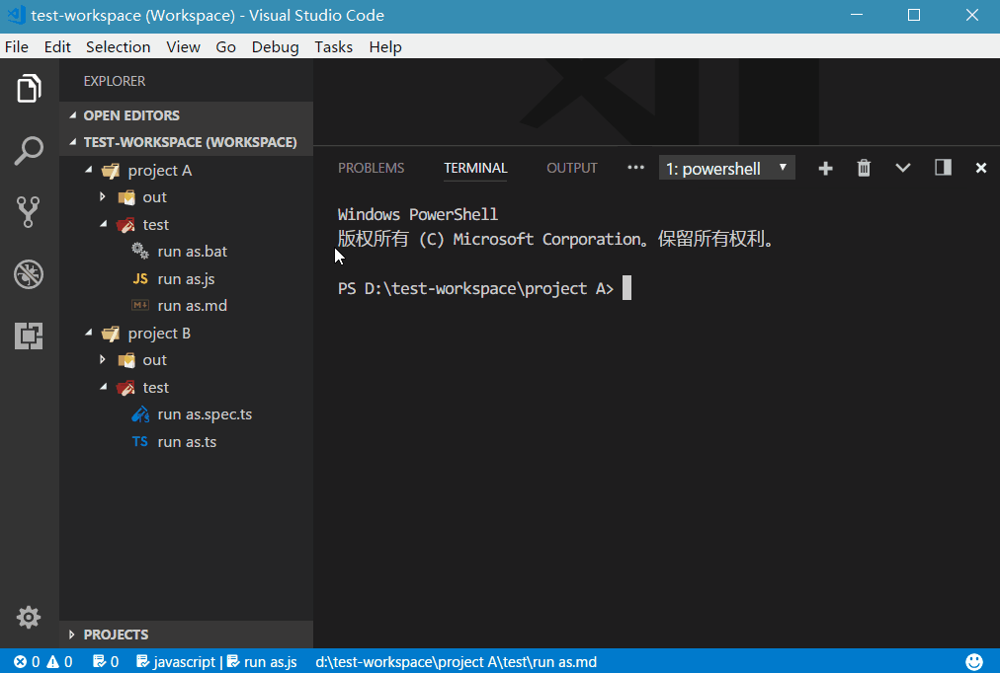

# Run As

[](https://marketplace.visualstudio.com/items/plylrnsdy.run-as) [](https://marketplace.visualstudio.com/items/plylrnsdy.run-as) [](https://marketplace.visualstudio.com/items/plylrnsdy.run-as)

VSCode extension.

## What can it do ?

**Right Click a file**, then
- Run `*.js` in node
- Run `*.spec.js` in mocha
- Run `*.ts` corresponding compiled `*.js` in node
- Run `*.spec.ts` corresponding compiled `*spec.js` in mocha 
- Run `*.bat`, `*.cmd`, `*.sh` in terminal
  - to run a **task** by right-clicking a script instead of typing a command
    - run a **server** in a new terminal windows
    - run a **watcher** in a new terminal windows
    - and so on
- Open `binary file`
  - in default application
  - in the application you like
- and so on

## Useage

After configuration, right Click a file, then select menu item "Run As ...".



## Configuration

Open VSCode `setting` (Ctrl+Comma), search for "runas" to change configuration:

### 1. Globs-to-command mapping

```json
"RunAs.globsMapToCommand": [{
    "globs": "*.*",
    "command": {
        "win32": "start ${file}",
        "linux": "see ${file}",
        "darwin": "open ${file}"
    },
    "exceptions": [
        {
            "globs": "*.@(bat|cmd|exe)",
            "command": "${file}",
            "exceptions": [
                {
                    "globs": "*.watcher.@(bat|cmd)",
                    "command": "@out ${file}"
                }
            ]
        },
        {
            "globs": "**/@(src|test)/**/*.ts",
            "command": "node ${`${root}/out/${dir}/${sFile}.js`}",
            "exceptions": [
                {
                    "globs": "*.spec.ts",
                    "command": "@in mocha ${file.replace(/(\\/(?:src|test)\\/)/, '/out$1').replace(/ts$/, 'js')}"
                }
            ]
        }
    ]
}]
```

#### 1.1 [globs](https://github.com/isaacs/node-glob)

A pattern to match file's path name.

#### 1.2 command

The command run in shell after selecting menu item "Run as ...".

**1.2.1 command template(s)**

- a general command, example: `"node ${file}"`
- or a platform-to-command map, example: `{ "win32": "start ${file}", "linux": "see ${file}", "darwin": "open ${file}" }`.

**1.2.2 command argument: path**

a javascript code snippet, it looks like `${/* javascript */}`. it can be: 

1. a **variable**, example: `${file}`
2. a **template string**, example: `` ${`${root}/out/${dir}/${sFile}.js`} ``
    - see: [TABLE-Variable-Meaning](#TABLE-Variable-Meaning)
3. a **javascript code snippet**, example: `${file.replace(/(\\/(?:src|test)\\/)/, '/out$1').replace(/ts$/, 'js')}`, this code snippet in default configuration means right click to run *.ts but actually execute the *.js in folder `out`.
    - PS: you need to use `\\` instead of `\` to _escape_ character in RegExp literal.

**1.2.3 command prefix: `@in`, `@out`**

if you want to execute a command in new terminal window or not, no matter whether `"RunAs.runInNewTerminalWindows.enable"` is true or false. You can add a prefix `@out ` or `@in ` in command.

#### 1.3 exceptions

A array of globs-to-command mapping, files matched one of them will execute itself command instead of it's parent's command.

#### TABLE-Variable-Meaning
| variable | meaning                                          | example                                   |
| -------- | ------------------------------------------------ | ----------------------------------------- |
| `file`    | full path of the file which you right clicked    | `D:\projects\project\src\common\module.ts` |
| `root`    | the folder opened in vscode                      | `D:\projects\project`                      |
| `rPath`   | the relative path from `root` to file             | `src\common\module.ts`                     |
| `dir`     | the relative path from `root` to file's directory | `src\common`                               |
| `lFile`   | the file's name with extension                   | `module.ts`                                |
| `sFile`   | the file's name without extension                | `module`                                   |
| `ext`     | the file's extension                             | `ts`                                       |

### 2. Execute command in a new terminal windows

```json
"RunAs.runInNewTerminalWindows": {
    "enable": false,
    "globs": "New Terminal Window",
    "command": {
        "win32": "Start-Process cmd -ArgumentList '/c ${command}'",
        "linux": "gnome-terminal -x bash -c '${command}'"
    }
}
```

In `"RunAs.runInNewTerminalWindows.commands"`,
- the key is platform string in VSCode:
    - Windows: `"win32"`,
    - Linux: `"linux"`
    - Mac OS: `"darwin"`
- the value is the command to execute command in a new terminal windows in this platform, e.g. `"start ${command}"`.
    - `${command}` will be replaced by the command in globs-to-command mapping.

You can enable it by change `"RunAs.runInNewTerminalWindows.enable"` to `true`.

## Install

Press `F1` in VSCode, type `ext install` and then look for `"Run as ..."` .

## Known Issue

- I do not know how to pass a command to a new terminal to execute it in Mac OS, but you can configure it by yourself.

## Issues

Submit the [issues](https://github.com/plylrnsdy/vscode-run-as/issues) if you find any bug or have any suggestion.

## Contribution

Fork the [repo](https://github.com/plylrnsdy/vscode-run-as) and submit pull requests.

## About

Author：plylrnsdy

Github：[vscode-run-as](https://github.com/plylrnsdy/vscode-run-as)